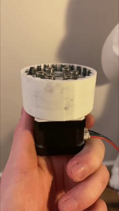
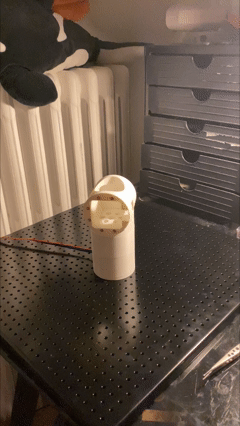
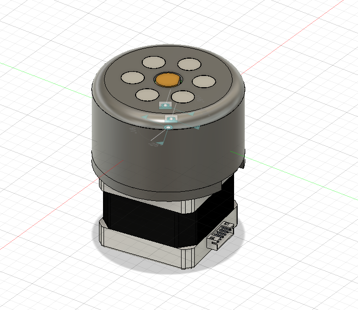
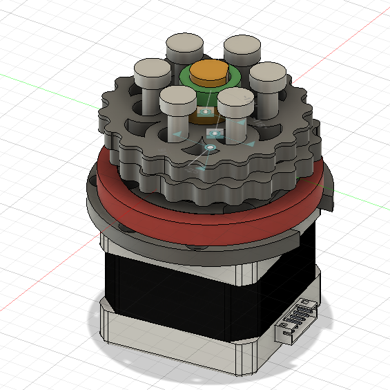

# Cycloidal Drive – NEMA 17

A compact **20:1 cycloidal gearbox** designed specifically for NEMA 17 stepper motors. The gearbox was fully designed from scratch in **Autodesk Fusion 360** and is intended to be manufactured using 3D printing.

  
  

  

  <em>The actual drive functionning on its own / actuating the first joint of the **Cyclone project** robot.</em>

## Specifications

- **Reduction ratio:** 20:1
- **Motor:** NEMA 17
- **Cycloidal discs:** 2
- **Pins:** 6
- **Manufacturing:** 3D printed
- **CAD:** Autodesk Fusion 360
- **Controller:** Arduino-compatible

  
  
  

  <em>Different views of the drive in Fusion360.</em>

## Project Cyclone

This gearbox is part of **Project Cyclone**, a larger personal robotics project focused on building a **5-DoF robotic arm** using custom cycloidal gearboxes.

The goal of the project is to explore the design, fabrication, and control of compact robotic joints using accessible components, 3D printing, and Arduino-based electronics.

## Repository

This repository contains the CAD files and related resources for the cycloidal gearbox.

The design is intended to be easy to reproduce, modify, and integrate into other robotics projects.

## Status

Personal project — actively developed.
